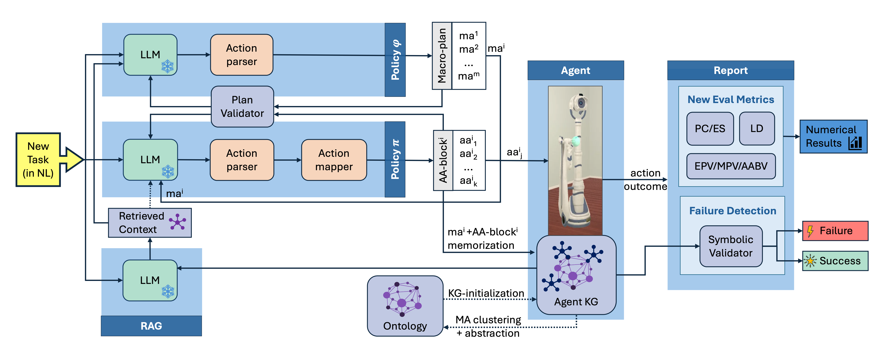

# HVR: Hierarchical Planning for Complex Tasks with Knowledge Graph-RAG and Symbolic Verification

This repository contains the code for the paper ``Learning Where and When to Reason in Neuro-Symbolic Inference`` (ICML-2025).

$${\color{red} The \space code \space will \space appear \space soon! }$$

<p align="center">

</p>


### How to cite:

```
@inproceedings{hvr_icml_2025,
title={Hierarchical Planning for Complex Tasks with Knowledge Graph-RAG and Symbolic Verification},
author={Flavio Petruzzellis and Cristina Cornelio and Pietro Lio},
booktitle={Forty-Second International Conference on Machine Learning (ICML)},
year={2025},
}
```
